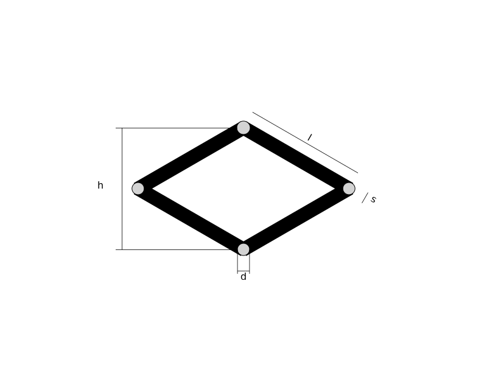

# Homework 1

## Prima parte

Il programma genera un file SVG riguardante un martinetto meccanico composto da un quadrilatero articolato 

Esempio del file generato `img_Martinetto_parametri.svg`

E' possibile inoltre tramite la funzione `StePer_save_scrissorlift()` salvare un file relativo ad un sollevatore pantografo
Esempio del file generato `img_pantografo.svg`

## Seconda parte

Nella seconda parte verrà invece integrato un'altro componente meccanico [non ancora definito] per la generazione di un file SVG riguardante una macchina. 
