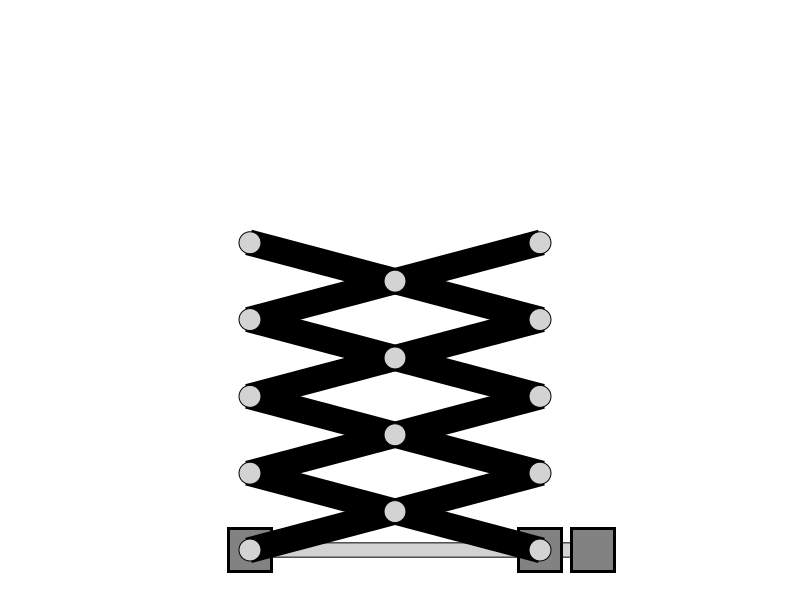
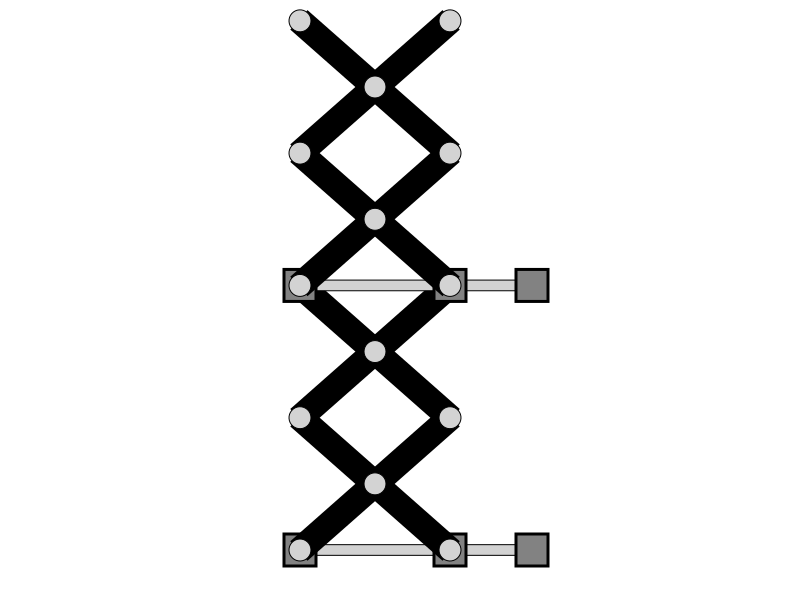

# Homework 1

## Prima parte

Il programma genera un file SVG riguardante un martinetto meccanico composto da un quadrilatero articolato, in particolare lanciando il programma mainEntry dopo aver lanciato CMake con il file CMakeLists.txt, è possibile generare interattivamente file analoghi al seguente. 

Esempio del file generato `img_Martinetto_parametri.svg`

E' possibile inoltre tramite la funzione `StePer_save_scrissorlift()` salvare un file relativo ad un sollevatore pantografo di questo tipo 

Esempio del file generato da mainEntry `img_pantografo.svg`

## Seconda parte

Nella seconda parte il programma integra il codice di matteodv99tn riguardante il componente guida prismatica (v1.2.0) per la generazione di un file SVG riguardante un sollevatore meccanico con meccanismo a pantografo.

In particolare lanciando secondaryEntry è possibile generare file analoghi al seguente in maniera interattiva

Esempio del file generato da secondaryEntry `img_sollevatore.svg`

Lanciando invece thirdEntry è possibile concatenare più sollevatori uno sopra l'alto 

Esempio del file generato da thirdEntry `img_sollevatore.svg`

