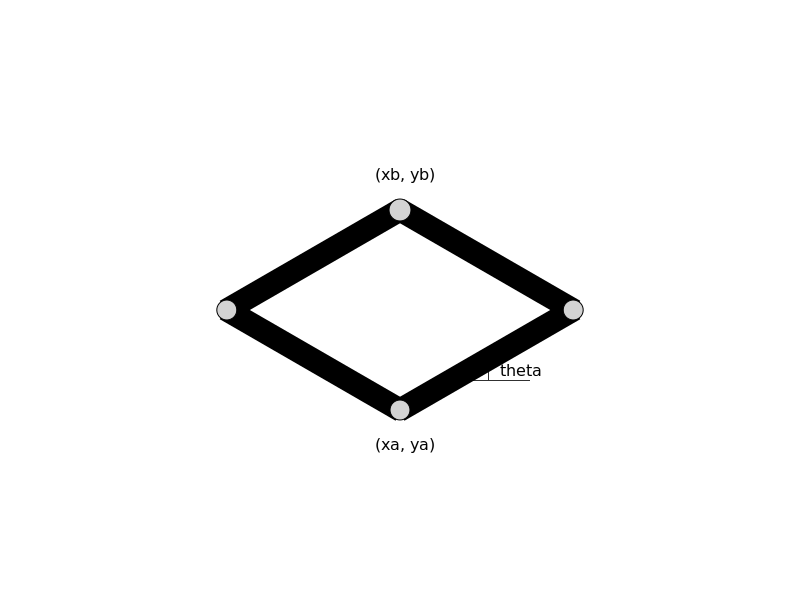

## Coordinate stampa

All'interno della struttura quadrilatero oltre ai 4 parametri relativi al componente sono presenti anche le 5 coordinate in figura utilizzate nella stampa del componente
 
Coordinate presenti in Quadrilatero `img_Martinetto_coordinate.svg`

